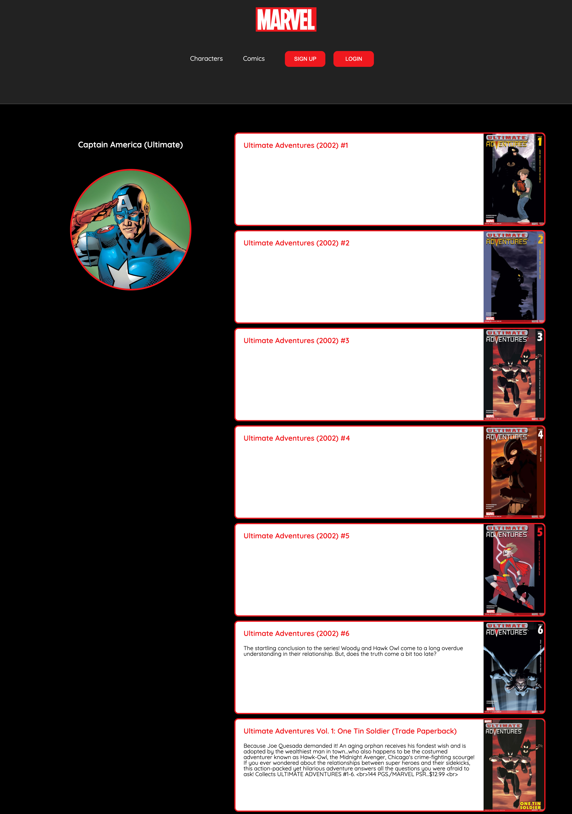
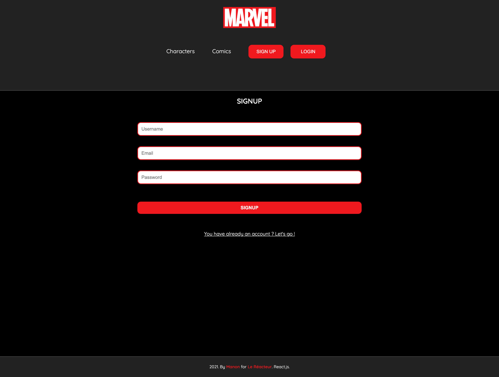
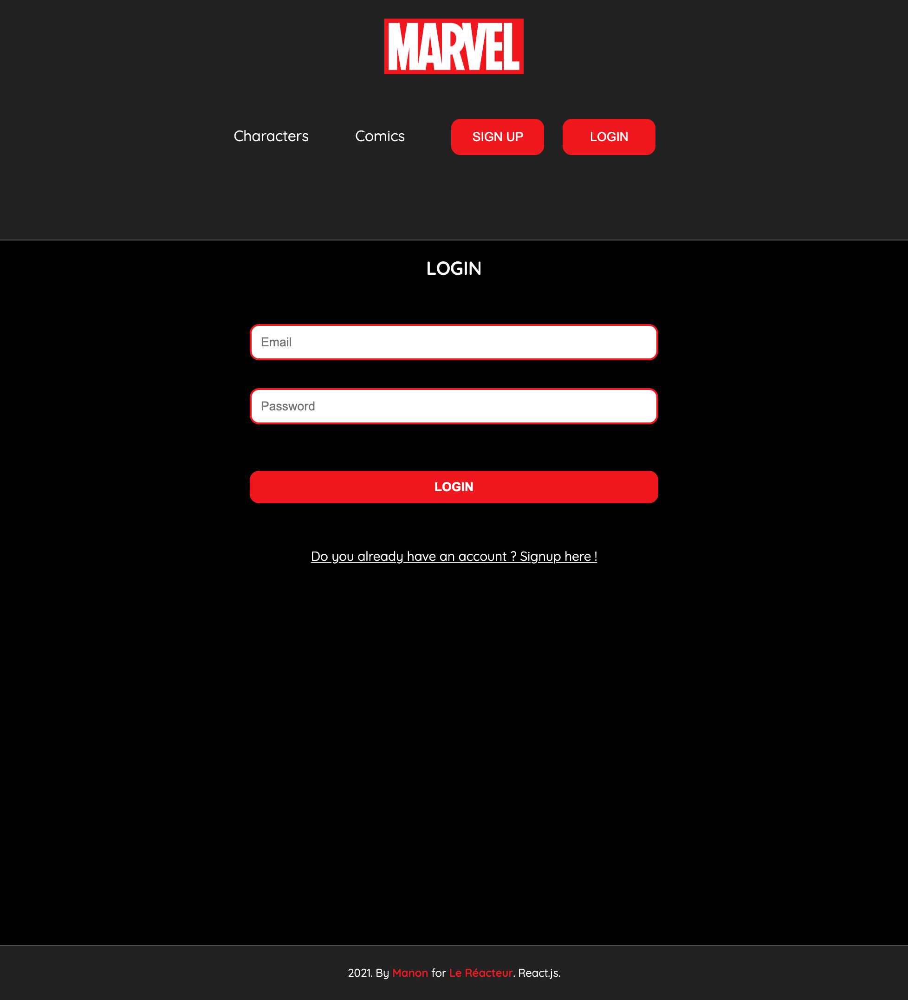

# marvel-front-LeReacteur

🗓 May 2021  
🪄 Fontend part of Marvel school projet (based on Marvel API - comics & characters)  
👀 Look at the backend repo!  
👉🏻 Check [that](https://mymarvel-lereacteur-2021.netlify.app/)

## Welcome in my Marvel school project 👩🏿‍🎤🥷🏼🦹🏻‍♀️

The Marvel Universe is a fictional universe where the stories in most American comic book titles and other media published by Marvel Comics take place. Super-teams such as the Avengers, the X-Men, the Fantastic Four, the Guardians of the Galaxy, the Defenders, the Midnight Sons, and many Marvel superheroes live in this universe, including characters such as Spider-Man, Iron Man, Thor, the Hulk, Ant-Man, the Wasp, Captain America, Wolverine, Captain Marvel, Black Panther, Doctor Strange, Scarlet Witch, Vision, Black Widow, Ghost Rider, Blade, the Silver Surfer, Nova, Daredevil, Iron Fist, the Moon Knight, the Punisher and Deadpool, among numerous others.

### My work?

To code a frontend (and a backend 👉🏻 look at the repo) based on a Marvel API. The layout was up to me 🤗!
Rules to follow:

- Display Marvel's characters on the home page
- Display Marvel's comics
- Display each character with a list of all his comics
- Create a navigation

- Display a search bar (search by name or title)
- Pagination
- Authentification: login and signup

## Stacks

JavaScript, React.js
HTML5, CSS3

🙏🏻 Thank you @LeReacteur.
